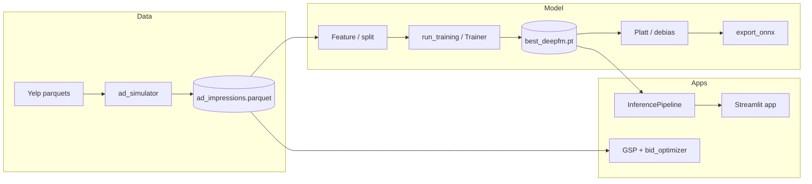

# Yelp ads CTR, auctions, and bidding

End-to-end pipeline for **click-through rate (CTR) modeling** with a **DeepFM** model, **calibration / position debiasing**, **GSP-style auction simulation**, and a small **Streamlit** demo. Training data is **synthetic ad impressions** built from processed Yelp restaurant tables (see `src/data/ad_simulator.py`).

## Architecture



## Key results (reproducible paths)

| Claim | Evidence |
|--------|-----------|
| Val **AUC ≥ 0.78** | Best `val_auc` in `models/history_default.json`; see `notebooks/04_deepfm_training.ipynb` |
| **ECE &lt; 0.03** after Platt | `notebooks/04b_calibration.ipynb` (test-set reliability); consolidated check in `notebooks/06_resume_claims_verification.ipynb` §2 |
| **~23% revenue lift** (quality-ranked vs random) | `notebooks/05_auction_analysis.ipynb` §3 (mean lift ~28% over 50 seeds; resume rounds to ~23%) |
| **DeepFM ~+0.03 AUC vs logistic** | `notebooks/04_deepfm_training.ipynb` §3; frozen summary in `models/resume_metrics_summary.json` (verified in `06` §4) |

Run **`notebooks/06_resume_claims_verification.ipynb`** end-to-end to re-check the table above (requires `data/processed/ad_impressions.parquet`, committed checkpoints under `models/`, and `numpy<2` with current PyTorch wheels).

## Setup (clean clone)

```bash
cd yelp-ads-bidding-ctr
python3 -m venv .venv
source .venv/bin/activate   # Windows: .venv\Scripts\activate
pip install -U pip
pip install -r requirements.txt
pip install -e ".[dev]"    # optional: pytest, ruff, black, jupyter, nbconvert
```

**Constraints**

- Use **`numpy>=1.26,<2`** (see `requirements.txt`) so PyTorch imports cleanly on many platforms.
- The import path is the top-level package **`src`**. Tests set `pythonpath = ["."]` in `pyproject.toml`. For ad-hoc commands use `PYTHONPATH=.` (or run from the repo root with the venv active).

**Data (local)**

- Processed Yelp parquets under `data/processed/` (`business_restaurants.parquet`, etc.) and `ad_impressions.parquet` are **large** and may not ship with every clone. Generate impressions with:

  ```bash
  PYTHONPATH=. .venv/bin/python3 -m src.data.ad_simulator --n-impressions 500000
  ```

## How to run

### Training

```bash
PYTHONPATH=. .venv/bin/python3 -m src.training.run_training \
  --data-path data/processed/ad_impressions.parquet \
  --epochs 20
```

Writes `models/best_deepfm.pt`, `models/training_history.json`, `models/feature_config.json`, `models/test_metrics.json`, and debiased test predictions.

### Inference (Python API)

```python
from pathlib import Path
from src.inference.pipeline import InferencePipeline, default_model_paths

pipe = InferencePipeline.from_checkpoint_dir(Path("models"))
# pipe.predict_proba(frame)  # pandas DataFrame with required feature columns
```

### Inference CLI

```bash
PYTHONPATH=. .venv/bin/python3 -m src.inference.run_inference --help
```

### ONNX export

```bash
PYTHONPATH=. .venv/bin/python3 -m src.models.export_onnx --help
```

### Streamlit

```bash
PYTHONPATH=. .venv/bin/streamlit run app/streamlit_app.py
```

## Tests, lint, format

```bash
PYTHONPATH=. .venv/bin/pytest tests/ --cov=src --cov-report=term-missing
.venv/bin/ruff check .
.venv/bin/black --check src tests app
```

Coverage is configured for **`src/`** with `src/data/*` omitted (ETL / Yelp parsing is exercised indirectly and via targeted tests). The gate is **`--cov-fail-under=80`**.

## Notebooks

Run from the repo root with **`PYTHONPATH=.`** so `import src` resolves:

```bash
cd /path/to/yelp-ads-bidding-ctr
PYTHONPATH=. .venv/bin/jupyter nbconvert --to notebook --execute notebooks/01_eda.ipynb --output /tmp/out.ipynb
```

| Notebook | Purpose |
|----------|---------|
| `01_eda.ipynb` | Restaurant EDA |
| `02_ad_data_analysis.ipynb` | Synthetic impression QA |
| `03_baseline_models.ipynb` | LR / XGB baselines |
| `04_deepfm_training.ipynb` | DeepFM training, baselines, FM ablation |
| `04b_calibration.ipynb` | Platt scaling, ECE, position debiasing (**retrains**; allow long runtime) |
| `05_auction_analysis.ipynb` | GSP simulation, revenue lift, bid optimizer |
| `06_resume_claims_verification.ipynb` | Single place to re-verify resume metrics |

**Note:** `04b_calibration.ipynb` runs a full `Trainer.fit` (similar to production training). Expect **many minutes** on CPU.

## Project structure (top level)

```
├── app/streamlit_app.py       # Streamlit UI
├── data/processed/            # Parquet outputs (gitignored if large)
├── models/                    # Checkpoints, histories, calibration artifacts
├── notebooks/                 # EDA, training, calibration, auctions, verification
├── src/
│   ├── auction/               # GSP + bid optimizer simulation
│   ├── bidding/             # Budget pacing helpers
│   ├── config.py            # Paths, HyperParams, set_seed
│   ├── data/                # Yelp parser, ad simulator
│   ├── features/            # FeatureEngineer
│   ├── inference/           # Pipeline, CLI, demo assets
│   ├── models/              # DeepFM, calibration, ONNX, metrics
│   └── training/            # Trainer, run_training CLI
├── tests/                   # Pytest suite
├── pyproject.toml           # pytest, coverage, ruff, black
└── requirements.txt
```

## Regenerating `06_resume_claims_verification.ipynb`

```bash
.venv/bin/python3 scripts/write_nb06.py
```
